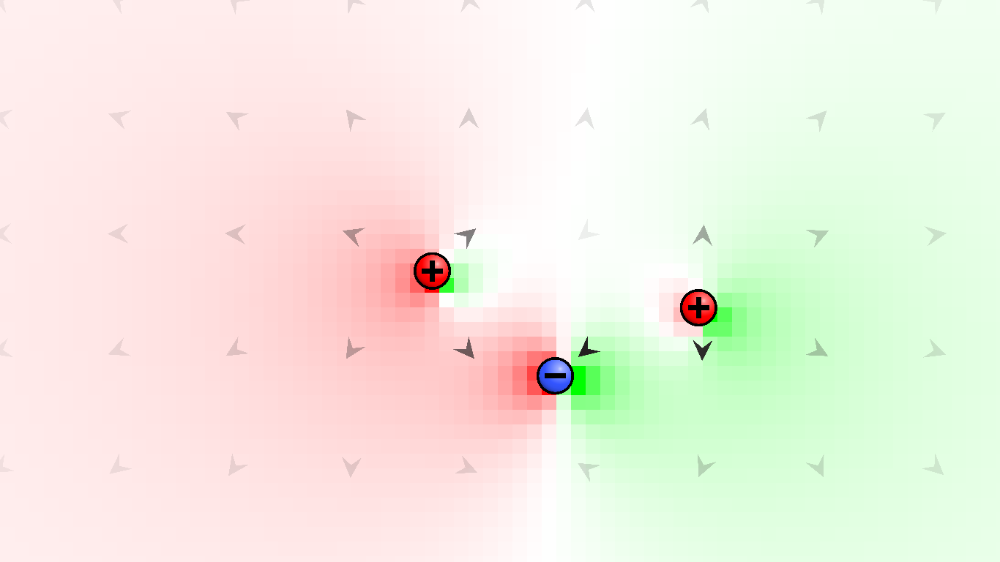

<head>

</head>

<!-- Enables MathJax -->

# About this project

This website gathers a series of projects developed during my undergraduate studies, focusing on the **computational simulation of physical systems**. The main goal is to make available:

- Interactive simulators that can be run directly in the browser  
- Theoretical explanations of the physical models involved  
- Well-documented and reusable source code

The simulations were implemented using **Python** and the **Godot Engine**, aiming to explore both the physical behavior and the computational visualization of the systems modeled.

> Note: This content is personal and independent, and has no formal affiliation with any academic institution or research program.

---

# Available simulators

 

  

  

    <strong><a href="./pasta/PENDULUM.html">Damped Pendulum</a></strong> 
    Numerical solution of the damped pendulum's equation of motion using the Euler method.
    In addition, user interaction was implemented, allowing the pendulum to be moved with the mouse.
    System parameters such as pendulum length and air viscosity can also be adjusted freely.
  

  

  

    <strong><a href="./pasta/CHARGE.html">2D Electromagnetism</a></strong> 
    It is possible to implement the laws of electromagnetism in three dimensions numerically within a simulation. However, this can be quite complex and computationally expensive. As an alternative, we could attempt to constrain the simulation to two dimensions, at the cost of discarding some of Maxwell's equations — which would be undesirable.
    
    In this project, we develop the dynamics of charged particles iteratively, implementing a theoretical model of electromagnetism in a 2D world.

  

## [Coupled Mass-Spring System](./simulators/coupled_springs.html)  
## [Oscillating Rings](./simulators/oscillating_rings.html)  
## [Dancing Flames](./simulators/dancing_flames.html)  
## [Projectile with Spring](./simulators/projectile_spring.html)  
## [Inclined Plane with Ball](./simulators/inclined_plane.html)

Each simulation is accompanied by a brief theoretical description and the corresponding implementation. In some cases, the source code is available for download or direct access.

---

# About the Author

My name is **Thales**, and I am an undergraduate student of Physics at the **Federal University of ABC (UFABC)**, located in the ABC metropolitan region of Brazil.

I have worked with simulations related to:

- the **maximum hydrogen adsorption capacity of materials**;
- the **prediction of mechanical properties**;
- the **prediction of electrical properties**;
- the **prediction of catalytic capacities for hydrogen production**.

In general, I employed computational methods based on **classical atomistic dynamics** and **quantum mechanics**.

Furthermore, I have participated in **physics competitions** focused on solving simple, open-ended physics problems, both **theoretically** and **experimentally**.

For feedback, suggestions, or collaboration inquiries, feel free to reach out via  
[GitHub](https://github.com/thalesphysics) or email at **thales.machado.fernandes@gmail.com**.

  

---

This site is powered by [GitHub Pages](https://pages.github.com)  
Equations are rendered using [MathJax](https://www.mathjax.org/)

